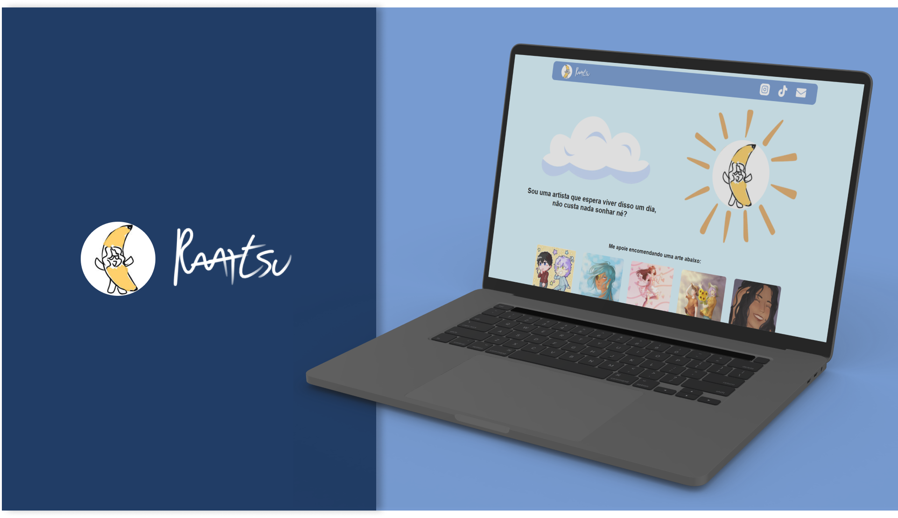
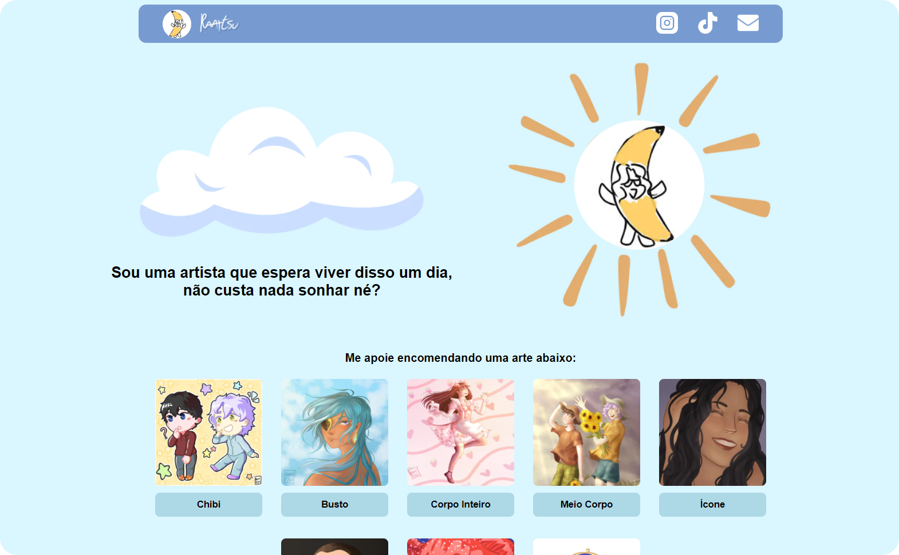

<h1 align="center">
  
</h1>

<h3 align="center">
  Landing Page Raartsu 🍌
</h3>

<p align="center">Aplicação web para encomendas de artes.</p>

<p align="center">

<a href="https://www.linkedin.com/in/klayverximenes/" target="_blank" rel="noopener noreferrer">

</a>
<a href="https://github.com/klayverxd/lp-raartsu/commits/main">

</a>
<a href="https://github.com/matheralvs/projeto-dsm/issues">

</a>
</p>

<p align="center">
<a href="#-sobre-o-projeto">Sobre o projeto</a> •
<a href="#-tecnologias">Tecnologias</a> •
<a href="#-layout-da-aplicação">Layout da aplicação</a> •
<a href="#-demonstração">Demonstração</a>
</p>

## ✅ Sobre o projeto

Este projeto é uma aplicação com fins de estudo sobre technologies web. A proposta do mesmo foi construir uma interface para apresentação de artes para encomendas utilizando Next.js e um back-end headless CMS.

## 🎨 Layout da aplicação

Você pode ver o layout do projeto no Figma no link abaixo:

- [Layout Desktop](https://www.figma.com/file/BoMvCY3DTWg04sl2uOx7Jd/Site-Raskel?type=design&node-id=5%3A28&mode=design&t=JRlaWg3cnQxmW2Fm-1)

Lembrando que você precisa ter uma conta no [Figma](http://figma.com/) para poder acessar.

## 📱 Demonstração



## 🚀 Tecnologias

Tecnologias que usei para desenvolver a aplicação:

- [ReactJS](https://pt-br.reactjs.org/)
  
- [Next.js](https://nextjs.org/)

- [TypeScript](https://www.typescriptlang.org/)
  
- [Dato CMS](https://www.datocms.com/)

## 🚀 Deploy da aplicação com Vercel

> https://raartsu.vercel.app/

This is a [Next.js](https://nextjs.org/) project bootstrapped with [`create-next-app`](https://github.com/vercel/next.js/tree/canary/packages/create-next-app).

## Getting Started

First, run the development server:

```bash
npm run dev
# or
yarn dev
# or
pnpm dev
```

Open [http://localhost:3000](http://localhost:3000) with your browser to see the result.

You can start editing the page by modifying `pages/index.tsx`. The page auto-updates as you edit the file.

[API routes](https://nextjs.org/docs/api-routes/introduction) can be accessed on [http://localhost:3000/api/hello](http://localhost:3000/api/hello). This endpoint can be edited in `pages/api/hello.ts`.

The `pages/api` directory is mapped to `/api/*`. Files in this directory are treated as [API routes](https://nextjs.org/docs/api-routes/introduction) instead of React pages.

This project uses [`next/font`](https://nextjs.org/docs/basic-features/font-optimization) to automatically optimize and load Inter, a custom Google Font.

## Learn More

To learn more about Next.js, take a look at the following resources:

- [Next.js Documentation](https://nextjs.org/docs) - learn about Next.js features and API.
- [Learn Next.js](https://nextjs.org/learn) - an interactive Next.js tutorial.

You can check out [the Next.js GitHub repository](https://github.com/vercel/next.js/) - your feedback and contributions are welcome!

## Deploy on Vercel

The easiest way to deploy your Next.js app is to use the [Vercel Platform](https://vercel.com/new?utm_medium=default-template&filter=next.js&utm_source=create-next-app&utm_campaign=create-next-app-readme) from the creators of Next.js.

Check out our [Next.js deployment documentation](https://nextjs.org/docs/deployment) for more details.
